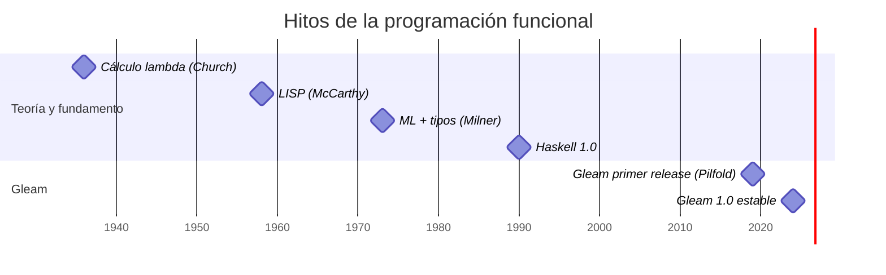

# Línea de tiempo de la programación funcional: de 1930 a Gleam (2024)

## Que es la programación funcional?

La programación funcional es un **paradigma de programación** que **se basa en el uso de funciones matemáticas para transformar datos y resolver problemas**. Utiliza el **cálculo lambda**, y en particular usa funciones puras para modelar soluciones de software. Estas se caracterizan por no tener efectos secundarios, y por depender únicamente de los argumentos de entrada a la hora de obtener un resultado.

Su característica distintiva es el **enfoque en el funcionamiento declarativo en lugar del imperativo**. Es decir, que no se describe cada paso para la ejecución de un proceso. Por el contrario, se define qué se debe hacer, para que el lenguaje de programación se encargue de la implementación concreta.

Este paradigma se utiliza, sobre todo, **para mejorar la concurrencia y la inmutabilidad en los programas**. Esta última, que se refiere a la incapacidad de modificar los datos una vez creados, ayuda a evitar errores que son difíciles de rastrear. Además, facilita el paralelismo, ya que los datos que se comparten entre procesos no se pueden alterar de forma inesperada.

La programación funcional tiene sus propios principios y paradigmas. Son los siguientes:

-   **Funciones puras**. El resultado depende solo de los argumentos; la misma entrada siempre producirá la misma salida. Facilita el análisis del código y lo hace previsible.
-   **Inmutabilidad**. Las estructuras de datos ya creadas no se pueden modificar. Para evitar errores asociados y la manipulación de aquellos cuando se comparten, se crean versiones nuevas de la misma estructura con las modificaciones pertinentes.
-   **Funciones de orden superior**. Pueden recibir otras funciones como argumentos o devolverlas como resultados. Por tanto, el código se puede reutilizar para operaciones complejas. Permite la flexibilidad.
-   **Composición de funciones**. Las funciones complejas se pueden construir a partir de varias simples. Las pipelines de procesamientos de datos tendrían entonces una composición modular y clara.
-   **Recursión**. Es el método que se usa para iterar sobre datos, en vez de usar bucles tradicionales. Va en la misma línea de la inmutabilidad, dado que cada llamada recursiva trabaja con una nueva versión de un dato.

**Imagen: Una función como caja negra: entra un dato, sale un resultado. Fuente: Barbulat / Getty Images**

## Linea de tiempo de la programación funcional 

-   **1930-1936 — Cálculo lambda: Alonzo Church formaliza el cálculo lambda, el fundamento matemático de todo lenguaje funcional.**
Inicialmente se empleó como instrumento matemático formal para el estudio de las funciones y su recursividad. Se puede considerar como uno de los lenguajes de programación universales más minimalistas y, sorprendentemente, no utiliza números indo-arábigos, caracteres alfanuméricos ni booleanos, tan solo tipos de datos basados en funciones; sin embargo, puede representar cualquier Máquina de Turing.    
-   **1958 — LISP: John McCarthy crea el primer lenguaje funcional; el más antiguo aún en uso después de FORTRAN**.
Es el segundo lenguaje de programación de mayor antigüedad, publicándose en el **MIT** después de Fortran poco antes de COBOL. Creado para seguir la notación matemática del cálculo lambda de Alonzo Church. **LISP** introdujo la posibilidad de definir estructuras de datos arborescentes y los tipos dinámicos de datos. Si bien en los años 1990 sufrió un cierto declive, a partir del libro de Peter Seibel despertó de nuevo interés, existiendo actualmente una comunidad activa que ofrece recursos y foros de discusión. Actualmente, **Common Lisp** y **Scheme** son las versiones más extendidas.
    
-   **1973 — ML: Robin Milner en Edimburgo inventa el ML, que introduce la inferencia de tipos (Hindley-Milner), base del tipado moderno.**
hbbiubiubi
    
-   **1990 — Haskell. Se define Haskell 1.0, el estándar abierto del paradigma puramente funcional y perezoso,**
Haskell es un lenguaje de **pro­gra­ma­ción puramente funcional**, cuya primera versión fue lanzada en 1990. Su nombre proviene del ma­te­má­ti­co Haskell Brooks Curry, que sentó las bases de los lenguajes de pro­gra­ma­ción funcional con su trabajo sobre lógica co­m­bi­na­to­ria (entre 1920 y 1960). Haskell se basa en el **cálculo lambda**. Los programas escritos en Haskell se re­pre­se­n­tan siempre como funciones ma­te­má­ti­cas, pero estas funciones **nunca** tienen **efectos se­cu­n­da­rios ni derivados**. De este modo, cada función utilizada siempre devuelve el mismo resultado con la misma entrada, y el estado del programa nunca cambia.
    
-  **2012 — Elixir y Elm: Elixir trae la sintaxis amigable a la VM BEAM; Elm lleva la FP pura y tipada al frontend web, inspirando a una nueva generación.**
**Elixir** es un lenguaje funcional de tipado dinámico que se basa en la máquina virtual de Erlang y se compila a código de bytes de Erlang. Este lenguaje de programación encapsula la programación funcional con estado inmutable y un enfoque de concurrencia basado en actores en una sintaxis moderna y elegante.
**Elm** es un lenguaje de programación funcional diseñado para facilitar la creación de interfaces de usuario interactivas. Desarrollado por Evan Czaplicki, Elm surgió como una respuesta a los desafíos que enfrenta el desarrollo de aplicaciones web complejas, donde la mantenibilidad, la escalabilidad y la ausencia de errores son vitales.

-   **2024 — Gleam 1.0: Primera versión estable de Gleam, compilando a BEAM y JavaScript.**
Se lanza la primera version estable de Gleam 1.0. **Gleam** es un lenguaje de programación funcional, estáticamente tipado y diseñado para construir sistemas de software escalables, predecibles y de bajo estrés.
Esta versión cubre todas las API públicas que se encuentran en el repositorio principal de Gleam en Git, es decir:
	-   El diseño del lenguaje Gleam.
	-   El compilador Gleam.
	-   La herramienta de compilación Gleam.
	-   El gestor de paquetes Gleam.
	-   El formateador de código Gleam.
	-   El servidor de lenguaje Gleam.
	-   La API WASM del compilador Gleam y los enlaces JavaScript.

	Sus características principales incluyen:
	-  **Ecosistema y Ejecución:** Se ejecuta en la máquina virtual de **Erlang** (BEAM), conocida por su gran tolerancia a fallos y alta escalabilidad en producción
	- **Sistema de Tipos e Inspiración:** Posee un análisis estático robusto con inferencia de tipos inspirado en lenguajes como Elm, OCaml y Rust.
	- **Simplicidad:** Prioriza un diseño consistente con una curva de aprendizaje rápida
	- **Herramientas Integradas:** Incluye en su flujo de trabajo un compilador rápido, gestor de paquetes, formateador de código, servidor de lenguaje (LSP) para editores de texto y soporte para WASM

  
  
--- 
## FUENTES

https://extension.uned.es/actividad/idactividad/47841
https://www.inesdi.com/blog/programacion-funcional/
https://museo.inf.upv.es/lisp/
https://www.ionos.mx/digitalguide/paginas-web/desarrollo-web/que-es-haskell/
https://gleam.run/news/gleam-version-1/
https://beecrowd.com/es/blog-posts/elm-3/
https://serokell.io/blog/introduction-to-elixir
